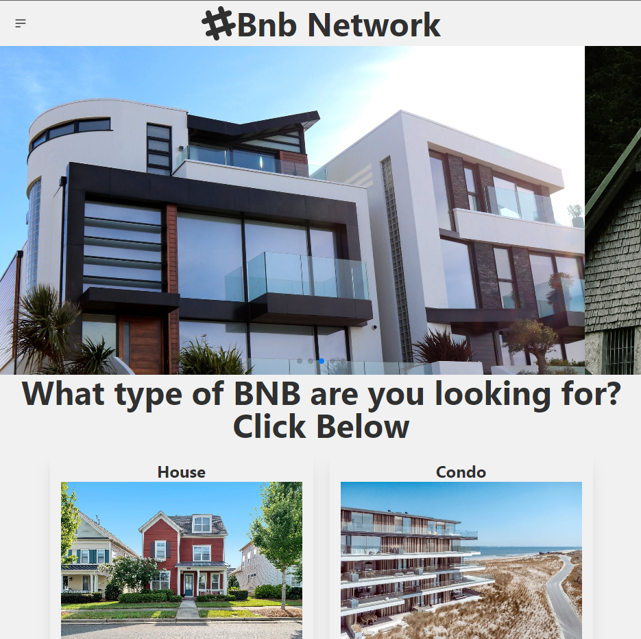
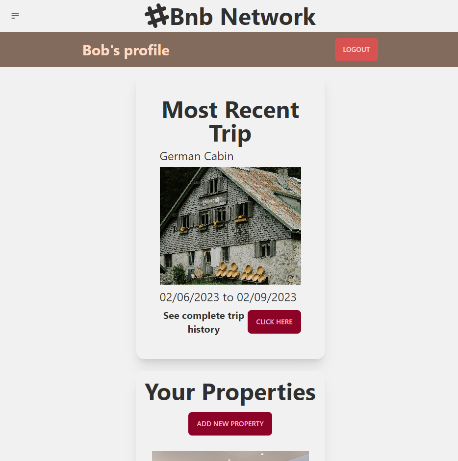

# Bnb Network

## This application is live

https://bnb-network.vercel.app/

## Description

This is a Full Stack Bed and Breakfast website that was inspired by AirBnb. Users can register, login, create bnb locations, book trips to existing locations, and view complete trip history. Styling was made mostly with the Daisy UI Tailwind Library.

## Installation

In the terminal run:

```
npm i
```
To start the React Server you must run:
```
npm start
```

## Usage
This is a Full Stack Application and you will be able to access the Location Exploration pages without being signed in. If you want to access the Location Detail pages to book a stay at a location, you will need to register or sign up. Each user will have his/her own profile page. Users can both book stays at Bnb Locations, or post their own properties that other users can make bookings on.


## Screenshot




## Contribution

MIT License

## Future Development
-Payment functionality
-Users cannot double book trips to the same location on the same days
-Add more login methodologies such as Google OAuth or SMS verification
-Add messaging system

## Questions

Feel free to reach out to me directly if you have any questions or concerns. You can reach me via email, or check out my github profile below.

Email: huntersteffner@gmail.com

GitHub: [huntersteffner](https://github.com/huntersteffner/)
